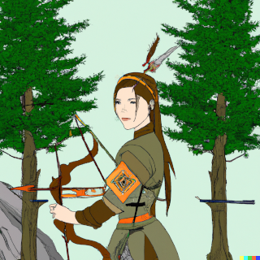

| Name | Splat | Aspect | PL / PP |
|-|-|-|-|
|  Simisi "Firball" Zhuliya | Dragon-Blooded | Wood | 8 / 150 (+5) |

| STRENGTH | AGILITY   | FIGHTING  | AWARENESS |
|----------|-----------|-----------|-----------|
|      4   |    4      |     4     |    4      |
| STAMINA  | DEXTERITY | INTELLECT |  PRESENCE |
|      4   |    4      |     4     |    4      |

64pp

|DODGE|FORTITUDE|PARRY|TOUGHNESS|WILL|
|-----|---------|-----|---------|----|
|   8 |  4      |  4  |  4 (8)  |  8 |

| INITTIATIVE | Bow    | Unarmed | 
|-------------|--------|---------|
|     +4      |   atk +12, dmg 3  |  atk +4, dmg +4   |

8pp

| Skills |
|--------|
|Expertise (Wood industry) +12 |
|Expertise (Wilderness survival) +12 |
|Insight	+12 |
|Investigation	+12 | 
|Perception +12 | 
|Ranged Attack (Bows) +12 |
|Stealth +12 |
|Treatment +12 |
|Vehicles +12  |

36pp

| Advantages        | |
|-------------------|-|
| Benefit: Status   | Dragon-Blooded. |
| Benefit: Wealth 3 | Noble estate, forestry business. |
| Equipment 2       | Jade Lamellar Armour (P4), Bow (dmg 3). |
| Luck 18           | Plot armour. |

24pp

| ARRAY ANCHOR | Create Firs R15 |
|--------------|-----------------|
| Base         | Create Object |
| Descriptors  | Wood, Plant, Dragon-Blooded |
| Action       | Standard |
| Range        | Ranged |
| Duration     | Permanent |
| Cost         | 1pp/rank +3 |
| Extras       | Permanent (+0), Subtle (1pp), Precise (1pp), Innate (1pp), Limited (-1). |
| Notes        | This power creates fir trees in locations plausibly capable of supporting them (ie. minimally adequate soil and support). |

18pp

| Complications | |
|---------------|-|
| Motivation: Noblesse oblige | Zhuliya feels an obligation to help her lessers, especially her dependents. |
| Weakness: Fear | Zhuliya fears dying, and supernatural fear effects are especially hard to resist. |

|Sidequests|
|----------|
|Tell them that the venerable Yanxiu Qimeng-Zhe wishes to restore the old rites and I will once again bless my descendants if they once again gather to sacrifice to me and my household, so the living may later join us in good standing and wealth.|
|Conclude card game with the Crossroads God. She owes me 5pp of good luck!|

(PROPOSED POWER)

| DYNAMIC ALTERNATE EFFECT  | Sudden Fir Attack R8    |
|---------------------------|-------------------------|
| Base         | Damage                      |
| Descriptors  | Wood, Plant, Dragon-Blooded |
| Action       | Standard                    |
| Range        | Ranged                      |
| Duration     | Instant                     |
| Cost         | 2pp/rank                    |
| Extras       | Linked (to anchor power), Increased Range (+1), Limited (-1).       |
| Notes        | First grow aggressively, damaging target. Same limitations apply as for normal fir creation. Amount of firs is reduced to R7. |

2pp + 2pp for 4 skill points in Ranged Attack (Tree)

(END PROPOSED POWER)
