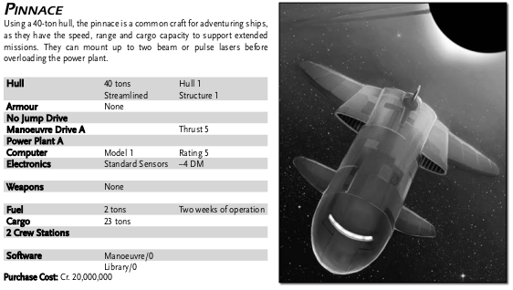
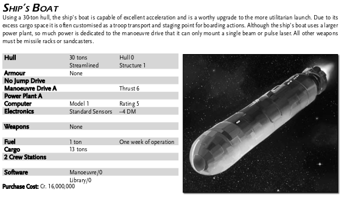

Padma
----------------

| Laboratory Ship |           |                    | Tons | Price        |
|-----------------|-----------|--------------------|------|--------------|
|Hull             |400 tons   | Hull 8/8, Stru 8/8 |      | 16 000 000   |
|Armour           |None       |                    |      |              |
|Jump Drive D     |           |Jump 2              |25    | 40 000 000   |
|Manoeuvre Drive D|           |Thrust 2            |7     | 16 000 000   |
|Power Plant D    |           |                    |13    | 32 000 000   |
|Bridge           |           |                    |20    |  2 000 000   |
|Computer         |Model 2    |Rating 10           |      |    160 000   |
|Electronics      |Advanced Sensors|  +1 DM        |3     |  2 000 000   |
|                 |           |                    |      |              |
|Weapons          |Double Turret| 2 Beam Lasers    |1     |  2 500 000   |
|                 |Triple Turret| 2 Beams, 1 Sand  |1     |  3 250 000   |
|                 |           |                    |      |              |
|Fuel             |88 tons    | One Jump–2 and 2wk ops|88 |              |
|Cargo            |69 tons    | 104 w/ small craft bays|68  |            |
|20 Staterooms    |           |                    |80    | 10 000 000   |
|                 |           |                    |      |              |
|Extras           |15 Probe drones |               |3     |  1 500 000   |
|                 |Laboratory space |              |20    |              |
|                 |Ship's Locker  | w/ laser guns  |      |    200 000   |
|                 |Pinnace    | 23 dtons cargo     |40    | 20 000 000   |
|            |Ship's Boat|Warren's, 13 dtons cargo |30    | 16 000 000   |
|                 |Fuel processors | 20 dt/d       |1     |     50 000   |
|Software         |Jump Control/2 |                |      |    200 000   |
|                 |Maneuvre/0 |                    |      |              |
|                 |Library/0  |                    |      |              |
|                 |           |                    |      |              |
|Maintenance cost (monthly) | |                    |      |     12323    |
|Life support cost (monthly) | |                   |      |     40 000   |
|Total tonnage and cost  |    |                    |  400 |147 874 000   |
|                |            |                    |      |              |
|Purchase price  |32 shares   | 30y old            |      | 85 594 320   |
|Monthly mortgage|            |                    |      |    366 018   |

Quirks
------
- Blacklisted as mutineer vessel (resolved)
- Laser guns in locker

Small craft
-----------

Cargo (104 dtons max)
---------------------
- 2 dtons Spare Parts
- 1 dton prototype Computer/5
- 1 dton sandcaster ammo (20 shots)
