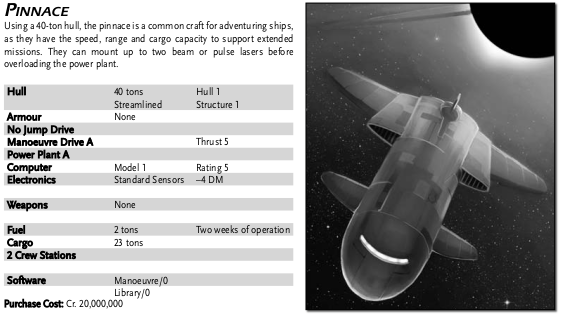
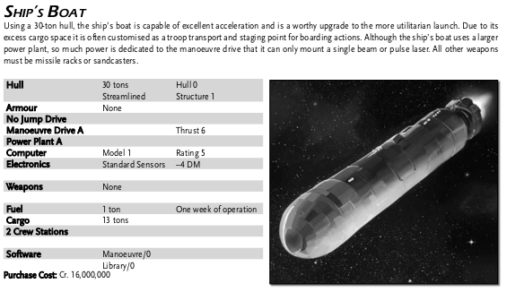

Unnamed Lab Ship
----------------

| Laboratory Ship |           |                    | Tons | Price        |
|-----------------|-----------|--------------------|------|--------------|
|Hull             |400 tons   | Hull 8, Structure 8|      | 16 000 000   |
|Armour           |None       |                    |      | 40 000 000   |
|Jump Drive D     |           |Jump 2              |25    | 16 000 000   |
|Manoeuvre Drive D|        |Thrust 2 (-1 DM quirk) |7     | 32 000 000   |
|Power Plant D    |           |                    |13    |  2 000 000   |
|Bridge           |           |                    |20    |    160 000   |
|Computer         |Model 2    |Rating 10           |      |  2 000 000   |
|Electronics    |Advanced Sensors|+1 DM (-1 quirk) |3     |              |
|                 |           |                    |      |              |
|Weapons          |None       |                    |      |              |
|                 |           |                    |      |              |
|Fuel             |88 tons    | One Jump–2 and 2wk ops|88 |              |
|Cargo            |21 tons    | Plus small craft bays|21  |              |
|20 Staterooms    |           |                    |      | 10 000 000   |
|                 |           |                    |      |              |
|Extras           |15 Probe drones |               |3     |  1 500 000   |
|                 |Laboratory space |              |70    |              |
|                 |Ship's Locker  |                |      |              |
|                 |Pinnace    | 23 dtons cargo     |40    | 20 000 000   |
|            |Ship's Boat|Warren's, 13 dtons cargo |30    | 16 000 000   |
|Software         |Jump Control/2 |                |      |    200 000   |
|                 |Maneuvre/0 |                    |      |              |
|                 |Library/0  |                    |      |              |
|                 |           |                    |      |              |
|Maintenance cost (monthly) | |                    |      |     11 823   |
|Life support cost (monthly) | |                   |      |     40 000   |
|Total tonnage and cost  |    |                    |  400 |141 874 000   |
|                |            |                    |      |              |
|Purchase price  |            | 30y old            |      | 85 594 320   |
|Monthly mortgage|            |                    |      |    356 643   |

Quirks
------
- Damaged thrusters (-1 to pilot checks)
- Damaged sensors (-1 to sensors checks)
- Secret modifier

Small craft
-----------

