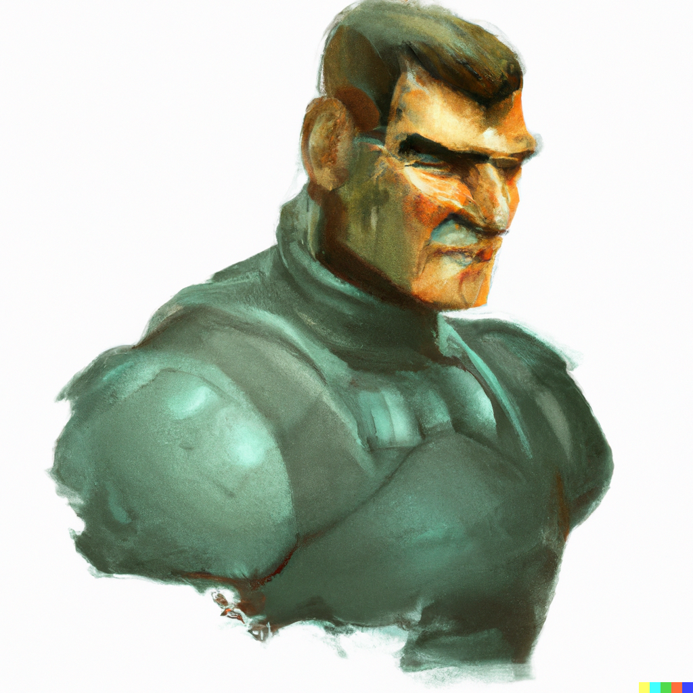

Lt. Warren Garfield
===================

| Str | Dex | End | Int | Edu | Soc |
|-----|-----|-----|-----|-----|-----|
|   4 |  6  |  7  |  11 |  12 |  9  |
|  -1 |  +0 |  +0 |  +1 |  +2 |  +1 |

| Age | Homeworld   | Nationality  |
|-----|-------------|--------------|
| 46  |  Pridewater |  Confederate |

Common Rolls
------------
- Divert Power +5
- Comms +3
- Sensors +3 (Padma +4)
- Mechanic +3

Skills
------
- Melee (blade) 3
- Gun Combat (slug) 2
- Engineer (J) 2 [+1]
- Astrogation 1 [+1]
- Battle Dress 1
- Comms 1
- Computer 1
- Gunner (turret) 1
- Leadership 1
- Mechanic 1
- Navigation 1
- Recon 1
- Sensors 1
- Language 0
- Pilot 0
- Survival 0
- Seafarer 0
- Social Science 0
- Zero-G 0

Training: Mechanic (14ish?/19, done May 13th)

History: none

Relations
---------
- Rival, an ambitious junior naval officer, acquired early in service
- Wife, Crystal, 41, an accountant on Pridewater, issue by:
  * Brian, 19
  * Denise, 16
  * Ashlyn, 16
- Contact, a merchant marine captain, met on a diplomatic mission

Equipment
--------

|Name          | TL | Value | Notes                            |
|--------------|----|-------|----------------------------------|
|Cash          | 1  |17 240 | Benefit                          |
|Gauss Pistol  | 13 | 500/20| From nationality. Damage 3d6, Auto 4, Rec -1, 0.5kg, 40 mag.|
|Ship's boat   | 8  | 16M   | Benefit.                         |
|TAS membership| 9  | Priceless| Benefit.                      |
|Cutlass       | 2  | 100   | Benefit. Damage 2d6+4, Heft -1, 1kg.|
|Cloth armour  | 10 | 500   | Protection 5, 1kg.               |
|Neural Comm   | 10 | 1k    | Implant. Audio only.             |
|Hand Computer | 12 | 2k    | Computer/3, 0.5kg.               |
|Software      | 11 | 2.1k  | Expert (J-drive) 1, Astrogation 1, Intelligent Interface 1.|
|Breather Mask | 8  | 150   | Filter + respirator.|
|Combat Armour | 12 |226 010| 10kg, requires BD 0. Computer weave (rating 1), eye protection, 6h life support, mag grapples. |
|CMC-300       | 9  | Loaned | 220/9 kg, +5 Str, requires BD 1. Comms, eye protection, magnetic boots, NBC shielding, drug injector, air filtering, one hour of life support in vacuum, visor HUD, computer-0 system. |

Other Assets
------------
- 6 ship shares in Padma, plus shareholder status

Passive Income
--------------
- Pension: 14000/yr
- TAS: 1 high passage/2mo (worth 6000 each)
 - Accumulated: 1

SUMMARY
-------
- Navy - diplomatic mission
- Navy - gain rival
- Navy - military engagement
- Navy - gain wife, no advance
- Navy - diplomatic mission, contact
- Navy - CO takes interest, commision
- Navy - advanced training, boring
- Muster out due to health

CHARGEN
-------

Background skills:
Survival 0 (HW)
Seafarer 0 (HW)
Social Science 0
Language 0

Basic training:
Pilot 0
Battle Dress 0
Zero-G 0
Gunner 0
Mechanic 0
Gun Combat 0

Career benefits:
Engineer (J) +1
Recon 1
Mechanic 1 (rank)
End +1
Navigation +1
Rival +1
Int +1
Battle Dress 1
Engineer (J) +1
Sensors 1
Soc +1
Melee (blade) +1
Wife +1
Gunner (turret) +1
Contact +1
Edu +1
End +1
Gun combat (slug) +1
Melee (blade) 1 (already got)
Melee (blade) +1
-1 End
+1 Dex
Leadership 1
Melee (blade) +1
-1 Str
-1 Dex
-2 End
50k
Int +1
Weapon
Soc +2
Ship shares +2
Ship's boat
Soc +2
TAS membership
Ship shares +2
Ship shares +2

Connections: 
term 1, gain Comms +1
term 7, gain Computer +1

Skill package: Astrogation 1 from Explorer pack

Career:
Rolls: 5, 6, 11, 9, 4, 8.
Age 18
abudhabi Request: [2d6+1] Roll: [5, 3] Result: 9 Reason: qualify for navy
Line/Crew
abudhabi Request: [1d6] Roll: [3] Result: 3 Reason: advanced education table
abudhabi Request: [2d6+1] Roll: [4, 4] Result: 9 Reason: survival 5+
abudhabi Request: [2d6] Roll: [4, 4] Result: 8 Reason: event
Your vessel participates in a diplomatic mission. Recon 1
abudhabi Request: [2d6+1] Roll: [6, 4] Result: 11 Reason: advancement 7+
Rank 1
abudhabi Request: [1d6] Roll: [3] Result: 3 Reason: personal dev
Age 22
Line/crew
abudhabi Request: [1d6] Roll: [5] Result: 5 Reason: advanced education
abudhabi Request: [2d6+1] Roll: [4, 3] Result: 8 Reason: survival 5+
abudhabi Request: [2d6] Roll: [6, 1] Result: 7 Reason: event
abudhabi Request: [2d6] Roll: [5, 3] Result: 8 Reason: life event
Betrayal: The character is betrayed in some fashion by a friend.
Gaining a Rival
abudhabi Request: [2d6+1] Roll: [6, 5] Result: 12 Reason: advancement 7+
Rank 2
abudhabi Request: [1d6] Roll: [4] Result: 4 Reason: personal dev
Age 26
Line/crew
abudhabi Request: [1d6] Roll: [3] Result: 3 Reason: advanced education
abudhabi Request: [2d6+1] Roll: [4, 2] Result: 7 Reason: survival 5+
abudhabi Request: [2d6] Roll: [4, 1] Result: 5 Reason: event
Your vessel participates in a notable military engagement. Gaining Sensors 1.
abudhabi Request: [2d6+1] Roll: [5, 4] Result: 10 Reason: advancement 7+
Rank 3
abudhabi Request: [1d6] Roll: [6] Result: 6 Reason: personal dev
Age 30
Line/crew
abudhabi Request: [1d6] Roll: [5] Result: 5 Reason: crew
abudhabi Request: [2d6+1] Roll: [4, 3] Result: 8 Reason: survival 5+
abudhabi Request: [2d6] Roll: [4, 3] Result: 7 Reason: event
abudhabi Request: [2d6] Roll: [4, 1] Result: 5 Reason: life event
Improved Relationship: A romantic relationship involving the character deepens, possibly leading to marriage or some other
emotional commitment.
Wife GET
abudhabi Request: [2d6+1] Roll: [3, 1] Result: 5 Reason: advancement 7+
Fail to advance, but stay in service.
Age 34
abudhabi Request: [2d6-4] Roll: [5, 4] Result: 5 Reason: aging
Line/crew
abudhabi Request: [1d6] Roll: [4] Result: 4 Reason: service skills
abudhabi Request: [2d6] Roll: [6, 2] Result: 8 Reason: event
Your vessel participates in a diplomatic mission. Gaining a Contact.
abudhabi Request: [2d6+1] Roll: [6, 5] Result: 12 Reason: advancement 7+
Rank 4
abudhabi Request: [1d6] Roll: [5] Result: 5 Reason: personal dev
Age 38
abudhabi Request: [2d6-5] Roll: [6, 5] Result: 6 Reason: aging
Line/crew
abudhabi Request: [1d6] Roll: [6] Result: 6 Reason: service skills
Your commanding officer takes an interest in your career. I'll take the +4 to next advancement (applies to commission, too, per GM)
abudhabi Request: [2d6+3] Roll: [3, 3] Result: 9 Reason: c'mon, commission! 8+
Officer Rank 1
abudhabi Request: [1d6] Roll: [4] Result: 4 Reason: officer
Age 42
abudhabi Request: [2d6-6] Roll: [4, 2] Result: 0 Reason: aging
-1 End
abudhabi Request: [1d6] Roll: [2] Result: 2 Reason: personal dev
abudhabi Request: [2d6+1] Roll: [6, 4] Result: 11 Reason: survival 5+
abudhabi Request: [2d6] Roll: [4, 1] Result: 5 Reason: event
You are given advanced training in a specialist field. Throw Education 8+ to gain one level in any skill you already have.
abudhabi Request: [2d6+2] Roll: [3, 1] Result: 6 Reason: 8+ for a skill bump
abudhabi Request: [2d6+2] Roll: [5, 3] Result: 10 Reason: advancement 7+
Officer Rank 2
abudhabi Request: [1d6] Roll: [4] Result: 4 Reason: officer
Age 46
abudhabi Request: [2d6-7] Roll: [3, 1] Result: -3 Reason: aging
-1 Str, -1 Dex, -2 End
For purposes of retirement, I'm rank 6 (4 NCO, 2 officer). I have 7 rolls from terms, plus 3 from rank, and a +1 bonus on all of them.
abudhabi Request: [1d6+1] Roll: [5] Result: 6 Reason: cash 1
abudhabi Request: [1d6+1] Roll: [1] Result: 2 Reason: benefits
abudhabi Request: [1d6+1] Roll: [3] Result: 4 Reason: benefits
abudhabi Request: [1d6+1] Roll: [6] Result: 7 Reason: benefits
abudhabi Request: [1d6+1] Roll: [2] Result: 3 Reason: benefits
abudhabi Request: [1d6+1] Roll: [5] Result: 6 Reason: benefits
abudhabi Request: [1d6+1] Roll: [6] Result: 7 Reason: benefits
abudhabi Request: [1d6+1] Roll: [4] Result: 5 Reason: benefits
abudhabi Request: [1d6+1] Roll: [4] Result: 5 Reason: benefits
abudhabi Request: [1d6+1] Roll: [4] Result: 5 Reason: benefits
